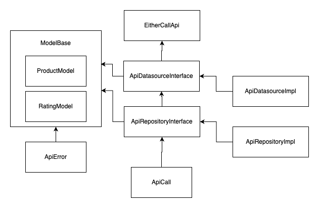

# Phase Two Dart Project Call Api

Project that solves phase 2 of the practical growth path in flutter.

## Download

Download phase_one project

```bash
  git clone git@github.com:felipepragma/phase_two.git
```

## Installation

Instalation flutter project

```bash
  dart pub get
  dart run
```
    
## Arch

Package using repository and datasource structure.

**Dartz:** Either class.

**Http:** http class.

